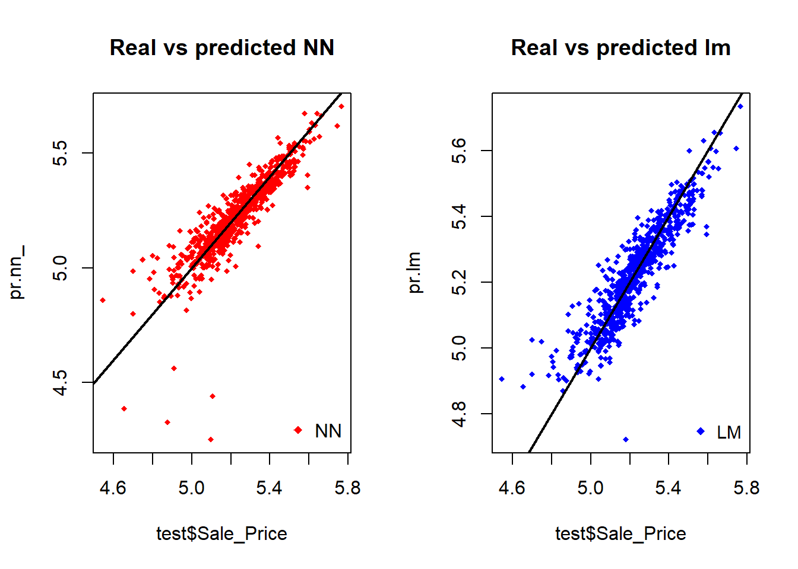

# Deep Learning Tutorial  

In this post I fit a simple neural network using the neuralnet package and fit a linear model as a comparison.  

To explore the strength of applying deep learning processes for prediction, we use the Ames housing data set from the package "modeldata".  

The original data set describes the sale of individual residential property in Ames, Iowa from 2006 to 2010. The data set contains 2930 observations and a large number of explanatory variables (23 nominal, 23 ordinal, 14 discrete, and 20 continuous) involved in assessing home values.  

We then restrict the data to include only relevant numeric columns to make the regressions and scaling methods needed for machine learning more manageable.  

```{r load_data}
knitr::opts_chunk$set(message = FALSE, warning = FALSE)
set.seed(500)
library(modeldata) # To access the Ames housing data set
data<- ames

data <- data[c('Lot_Area','Year_Built','Year_Remod_Add',
               'Mas_Vnr_Area','Total_Bsmt_SF','Gr_Liv_Area',
               'Bedroom_AbvGr','Fireplaces','Garage_Cars',
               'Wood_Deck_SF','Screen_Porch','Pool_Area','Misc_Val',
               'Year_Sold','Latitude','Longitude','Sale_Price')]
str(data)
library(dplyr)
data <- data %>% mutate(Sale_Price = log10(Sale_Price))
```

We take log (base 10) of Sales_Price to convert the dependent variable to a set of linear values.  
We also check for missing data to ensure a complete set, important for establishing deep learning analyses.  

```{r check_missing}
apply(data,2,function(x) sum(is.na(x))) # 2 indicates run function for columns
```

Data looks ok so let's proceed.  

Next we randomly split the data into a train and a test set. We reserve 25 per cent of the data for testing.  

```{r split_data}
index <- sample(1:nrow(data),round(0.75*nrow(data)))
train <- data[index,]
test <- data[-index,]
```

Next we fit a simple linear regression model against all covariates to estimate the explanatory power of the data set for determining the log of the sales price of homes in Ames.  

The aim is to produce the linear model, use it predict sales prices in the test data set, and then measure the errors between the predicted value and the observed value, summarised using the mean squared error calculation (MSE.lm).  

```{r fit_linear_regression}
lm.fit <- glm(Sale_Price~., data=train)
summary(lm.fit)
pr.lm <- predict(lm.fit,test)
MSE.lm <- sum((pr.lm - test$Sale_Price)^2)/nrow(test)
```

# NEURAL NETWORK  

Now we set up the data for analysing through the neural net.  

### Step 1. Normalise Data.  

```{r normalise_data}
maxs <- apply(data, 2, max) 
mins <- apply(data, 2, min)
scaled <- as.data.frame(scale(data, center = mins, scale = maxs - mins))
train_ <- scaled[index,]
test_ <- scaled[-index,]
```

### Step 2. Neural Network.  

We set up two hidden layers with a configuration of 17:5:3:1.  

This means we assume there the input layer = 17 inputs, 2 hidden layers = 5, and 3 neurons 
while the output layer = 1 output.  

```{r fit_nnet}
library(neuralnet)
n <- names(train_)
f <- as.formula(paste("Sale_Price ~", paste(n[!n %in% "Sale_Price"], collapse = " + ")))
nn <- neuralnet(f,data=train_,hidden=c(5,3),linear.output=T)
```

We plot the neural network. Black lines indicate the connections between each layer and the weights on each connection. The blue lines indicate the bias term added for each step, which can be interpreted as the intercept of the linear model.  

The neural net is a black box so we can't observe the fitting process directly, nor can we understand precisely how the weights in the model are derived. However we can see that the training algorithm has achieved convergence.  

```{r plot_nnet, eval=FALSE}
plot(nn)
```

<!-- -->

### Step 3. Predicting Sale_Price using the neural network.  

The results need to be rescaled so the model is used appropriately on the original data set for prediction.  

```{r predict_nnet}
pr.nn <- neuralnet::compute(nn,test_[,1:16]) # all columns excluding y variable
pr.nn_ <- pr.nn$net.result*(max(data$Sale_Price)-min(data$Sale_Price))+min(data$Sale_Price)
test.r <- (test_$Sale_Price)*(max(data$Sale_Price)-min(data$Sale_Price))+min(data$Sale_Price)
MSE.nn <- sum((test.r - pr.nn_)^2)/nrow(test_)
```

We then compare the two MSEs from the linear regression and the neural net. The neural net modestly outperforms the linear regression (lower error term).  

```{r print_mse}
print(paste(MSE.lm,MSE.nn))
```

Plots of the results for the neural net relative to the linear regression are plotted. Predictions from the neural network appear slightly more concentrated around the line (perfect prediction) than those made by the linear model.  

```{r nnet_plots, eval=FALSE}
par(mfrow=c(1,2))

plot(test$Sale_Price,pr.nn_,col='red',main='Real vs predicted NN',pch=18,cex=0.7)
abline(0,1,lwd=2)
legend('bottomright',legend='NN',pch=18,col='red', bty='n')

plot(test$Sale_Price,pr.lm,col='blue',main='Real vs predicted lm',pch=18, cex=0.7)
abline(0,1,lwd=2)
legend('bottomright',legend='LM',pch=18,col='blue', bty='n', cex=.95)

```

<!-- -->

The combined plot indicates the modest gains from the neural network in more detail.  

```{r combined_plot , eval=FALSE}
par(mfrow=c(1,1))

plot(test$Sale_Price,pr.nn_,col='red',main='Real vs predicted NN',pch=18,cex=0.7)
points(test$Sale_Price,pr.lm,col='blue',pch=18,cex=0.7)
abline(0,1,lwd=2)
legend('bottomright',legend=c('NN','LM'),pch=18,col=c('red','blue'))
points(test$Sale_Price,pr.lm,col='blue',pch=18,cex=0.7)
```

<!-- -->

## Cross Validation  

Cross validation can be a useful process for building predictive models. Cross validation methods should adopt some form of iterating the following process several times:

1. Do the train-test split
2. Fit the model to the train set
3. Test the model on the test set
4. Calculate the prediction error
5. Repeat the process K times  

```{r cv_setup}
library(boot)
set.seed(200)
lm.fit <- glm(Sale_Price~.,data=data) #medv
cv.glm(data,lm.fit,K=10)$delta[1]
```

We can then implement the NNet on a split data set (90 per cent training and 10 per cent test) and randomly iterate it 10 times.  

```{r cv_split}
set.seed(450)
cv.error <- NULL
k <- 10
```

We then run the iteration through a loop. To check on progress we use the progress bar from plyr.  

```{r cv_loop, eval=FALSE}
library(plyr) 
pbar <- create_progress_bar('text')
pbar$init(k)

for(i in 1:k){
  index <- sample(1:nrow(data),round(0.9*nrow(data)))
  train.cv <- scaled[index,]
  test.cv <- scaled[-index,]
  
  nn <- neuralnet(f,data=train.cv,hidden=c(5,2),linear.output=T)
  
  pr.nn <- neuralnet::compute(nn,test.cv[,1:17])
  pr.nn <- pr.nn$net.result*(max(data$Sale_Price)-min(data$Sale_Price))+min(data$Sale_Price)
  
  test.cv.r <- (test.cv$Sale_Price)*(max(data$Sale_Price)-min(data$Sale_Price))+min(data$Sale_Price)
  
  cv.error[i] <- sum((test.cv.r - pr.nn)^2)/nrow(test.cv)
  
  pbar$step()
}

mean(cv.error)
cv.error
```

The results are produced using the below and we produce a boxplot of the results. 

```{r cverror_plot, eval=FALSE}
boxplot(cv.error,xlab='MSE CV',col='cyan',
        border='blue',names='CV error (MSE)',
        main='CV error (MSE) for NN',horizontal=TRUE)
```

<!-- -->

The average MSE for the neural network is lower than the one of the linear model. But there is some variation in the MSEs of the cross validation, which depend on both the splitting of the data and the random initialization of the weights in the net. By running the simulation different times with different seeds a more precise estimate for the average MSE would be obtained.  

## Model interpretability  

Neural networks are very useful but remain, in many ways, a black box. The explanatory power of neural networks are less efficient than their predictive power. Simpler linear models demonstrate significant abilities to explain relationships in data, while neural networks do not. If prediction is critical for the task at hand, then neural networks may offer an advantage over traditional statistical methods.

### Double check using a random forest  

We can of course check the quality of the results using a random forest to compare with the above methods.  

```{r rand-forest}
library(randomForest)
set.seed(12345)
fit.rf <- randomForest(formula = Sale_Price ~ ., data = train)

set.seed(12345)
pred.rf <- predict(fit.rf, test)

rmse.rf <- sqrt(sum(((pred.rf) - test$Sale_Price)^2)/
                  length(test$Sale_Price))
c(RMSE = rmse.rf, pseudoR2 = mean(fit.rf$rsq))
```

The values look ok but seem to result in a larger error than offered above. This could be an analysis task for another time...  

Thank you for reading. Comments welcome.  